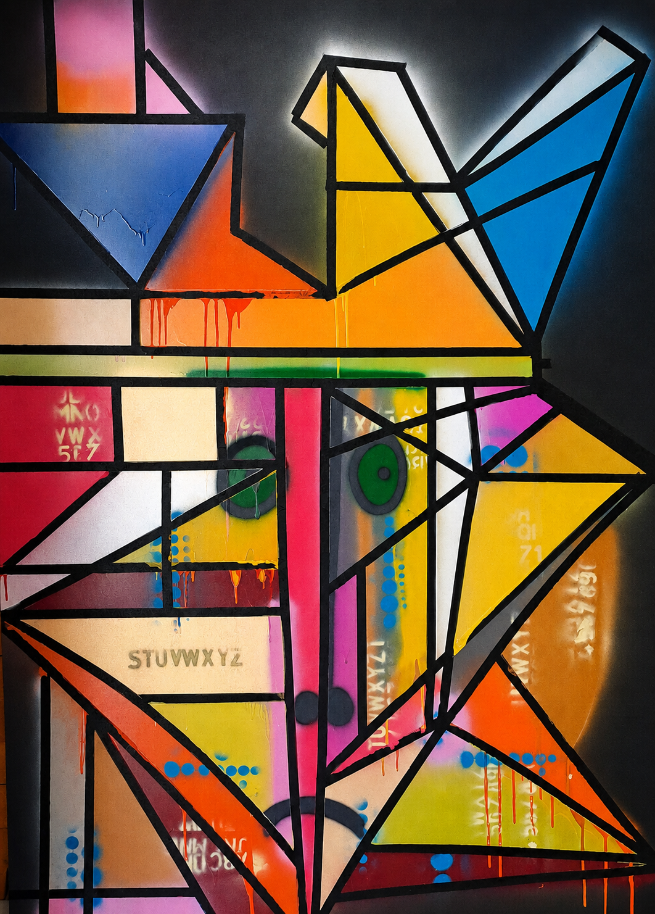

# The Abstract Human Protocol v1.0.0


## 👁️ The Manifesto
This repository contains the source code of human consciousness expressed through analog geometry. While the world automates art using AI, this project compiles human error, texture, and brushstrokes directly into the fabric of open-source software. The physical canvas acts as the Central Server; this code is its global distribution.

In a reality governed by binary logic, this piece breaks the loop. The intersecting black vectors simulate a cognitive firewall, trapping the raw emotions and vibrant matrices trapped underneath. It is not just an image; it is an organic interface designed to bridge human empathy with digital environments.

## 🛠️ Installation & Execution
1. Clone the repository to your local environment:
   ```bash
   git clone https://ojosdelbarroco.es/arte-contemporaneo/artistas/polosky/
   ```
2. Open the `human-face-geometry-code.svg` file in any web browser or IDE.
3. Stare at the central green modules for 60 seconds to execute the empathy patch on your local system.

## 🐛 Known Issues & Debugging
* **[BUG #001]**: Excess of melancholy detected in the lower facial node. The sadness matrix currently slows down emotional compilation. Pull requests to optimize the visual balance are welcome.
* **[REFACTOR]**: Feel free to fork this repository to recreate the geometric grid using pure CSS, animate the vectors with JavaScript, or port the color arrays into JSON format.

## 📄 License & Provenance
This digital codebase is licensed under the MIT License. Anyone is free to replicate, fork, or modify the vectors. 

However, the original physical canvas captured in the image represents the **Genesis Block**. It remains the single, unrepeatable source of truth and is held exclusively by the author.

---
*For collectors: To acquire the physical Genesis Block or verify ownership via cryptographic signature, please open a private inquiry by reaching out to [juannorsk@gmail.com].*
